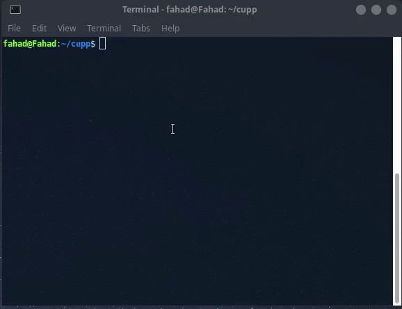

# CUPP - Common User Passwords Profiler

 
## About

  The most common form of authentication is the combination of a username
  and a password or passphrase. If both match values stored within a locally
  stored table, the user is authenticated for a connection. Password strength is
  a measure of the difficulty involved in guessing or breaking the password
  through cryptographic techniques or library-based automated testing of
  alternate values.

  A weak password might be very short or only use alphanumberic characters,
  making decryption simple. A weak password can also be one that is easily
  guessed by someone profiling the user, such as a birthday, nickname, address,
  name of a pet or relative, or a common word such as God, love, money or password.

  That is why CUPP was born, and it can be used in situations like legal
  penetration tests or forensic crime investigations.

Requirements
------------

You need Python 3 to run CUPP.

Quick start
-----------

    $ python3 cupp.py -h

## Options

  Usage: cupp.py [OPTIONS]

        -h      this menu

        -i      Interactive questions for user password profiling

        -w      Use this option to profile existing dictionary,
                or WyD.pl output to make some pwnsauce :)

        -l      Download huge wordlists from repository

        -a      Parse default usernames and passwords directly from Alecto DB.
                Project Alecto uses purified databases of Phenoelit and CIRT which where merged and enhanced.

        -v      Version of the program

## Configuration

   CUPP has configuration file cupp.cfg with instructions.

## Example (Fast forwarded)

## License

  This program is free software; you can redistribute it and/or modify
  it under the terms of the GNU General Public License as published by
  the Free Software Foundation; either version 3 of the License, or
  any later version.

  This program is distributed in the hope that it will be useful,
  but WITHOUT ANY WARRANTY; without even the implied warranty of
  MERCHANTABILITY or FITNESS FOR A PARTICULAR PURPOSE.  See the
  GNU General Public License for more details.

  You should have received a copy of the GNU General Public License
  along with this program; if not, write to the Free Software
  Foundation, Inc., 59 Temple Place, Suite 330, Boston, MA  02111-1307  USA

  See './LICENSE' for more information.

## Github import

This project was imported into https://github.com/Mebus/cupp by Mebus from:  
http://www.remote-exploit.org/content/cupp-3.0.tar.gz  
http://www.remote-exploit.org/articles/misc_research__amp_code/index.html  
to encourage further development of the tool.

## Original author

  Muris Kurgas aka j0rgan  
  j0rgan@remote-exploit.org  
  http://www.remote-exploit.org  
  http://www.azuzi.me  

## Contributors

  * Bosko Petrovic aka bolexxx  
  bole_loser@hotmail.com  
  http://www.offensive-security.com  
  http://www.bolexxx.net  

  * Mebus  
    https://github.com/Mebus/  

  * Abhro  
    https://github.com/Abhro/  

  * Andrea Giacomo  
    https://github.com/codepr

  * quantumcore  
    https://github.com/quantumcore
    

